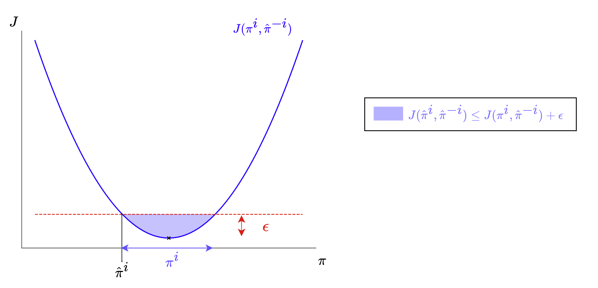
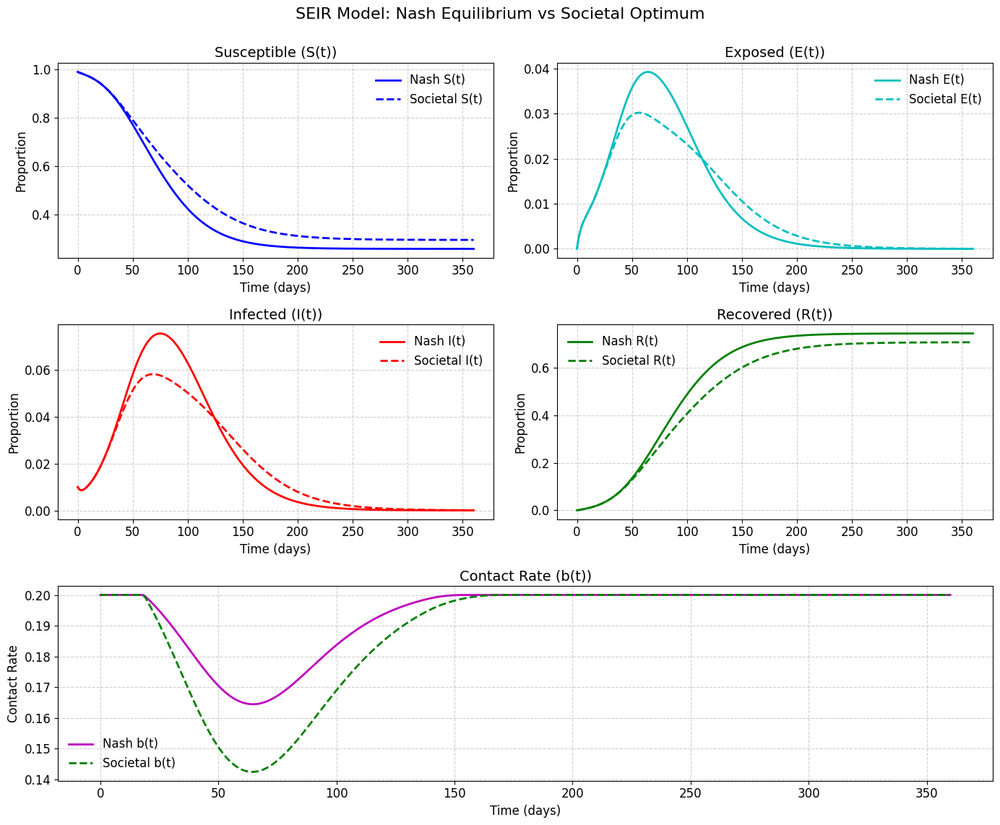
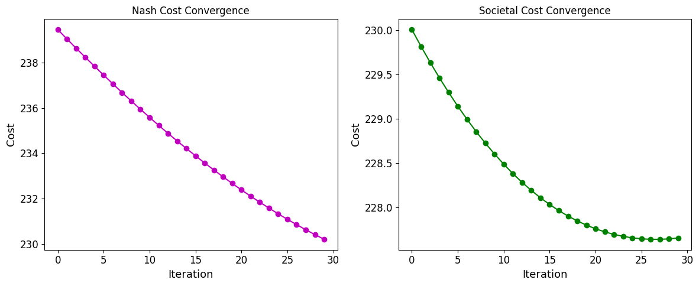

# Mean Field Games Simulation and Introduction: a Reinforcement Learning Approach in Python

#### Table of Contents

1. [Introduction](#introduction)
2. [Mean Field Game in the Static Setting](#mean-field-game-in-the-static-setting)  
   - [Action Space](#action-space)  
   - [Cost Function](#cost-function)  
   - [Static Setting](#static-setting)  
   - [Nash Equilibrium (NE)](#nash-equilibrium-ne)  
   - [Examples of Nash Equilibrium](#examples-of-nash-equilibrium)  
     - [Target Position with No Interaction](#1-target-position-with-no-interaction)  
     - [Attraction Through the Mean](#2-attraction-through-the-mean)  
     - [Group Aversion](#3-group-aversion)  
     - [Rock-Paper-Scissors](#4-rock-paper-scissors)  
     - [Prisoner's Dilemma](#5-prisoners-dilemma)  
   - [Mixed Strategy Nash Equilibrium](#mixed-strategy-nash-equilibrium)  

3. [Static Mean Field Game](#static-mean-field-game)  
   - [Homogeneity and Anonymity](#homogeneity-and-anonymity)  
   - [Empirical Distribution of Actions](#empirical-distribution-of-actions)  
   - [Passing to the Limit](#passing-to-the-limit)  
   - [Mean Field Nash Equilibrium](#mean-field-nash-equilibrium)  

4. [Approximate Nash Equilibrium](#approximate-nash-equilibrium)  
   - [Proof Sketch for Approximate Nash Equilibrium](#proof-sketch-for-approximate-nash-equilibrium)  
   - [Key Observations](#key-observations)  


### Table of Contents
1. [Overview](#overview)  
2. [Mathematical Formulation](#mathematical-formulation)  
   1. [Epidemiological Dynamics (SEIR)](#epidemiological-dynamics-seir)  
   2. [Behavioral Dynamics](#behavioral-dynamics)  
   3. [Nash Equilibrium](#nash-equilibrium)  
   4. [Societal Optimum](#societal-optimum)  
3. [Code Structure](#code-structure)  
   1. [Global Parameters & Initialization](#global-parameters--initialization)  
   2. [Cost Functions](#cost-functions)  
   3. [Baseline SEIR Solution (No Effort)](#baseline-seir-solution-no-effort)  
   4. [SEIR Dynamics with Additional State Variables](#seir-dynamics-with-additional-state-variables)  
   5. [Costate Equations for Nash Equilibrium](#costate-equations-for-nash-equilibrium)  
   6. [Gradient Calculation for Nash Equilibrium](#gradient-calculation-for-nash-equilibrium)  
   7. [Nash Equilibrium Fixed-Point Iteration](#nash-equilibrium-fixed-point-iteration)  
   8. [Societal Optimum](#societal-optimum-implementation)  
   9. [Main Execution / Example](#main-execution--example)  
4. [Dependencies](#dependencies)  
5. [Usage Instructions](#usage-instructions)  
6. [References](#references)  


## 1 Mean Field Game in the Static Setting

Consider a game with $N$ players, denoted as $\{1, \dots, N\}$. 

### Action Space
Each player $i \in \{1, \dots, N\}$ can choose an action $a^i$ from the action space $\mathcal{A}$. The collection of actions from all players is referred to as the **population profile of actions**, denoted by:

$$
\underline{a} = \{a^1, a^2, \dots, a^N\} \in \mathcal{A}^N
$$

### Cost Function
Each player $i$ has a cost function $f^i(\underline{a})$, where:

$$
f^i : \mathcal{A}^N \to \mathbb{R}
$$

The goal of each player is to minimize their cost by selecting an optimal action:

$$
\min_{a^i} f^i(\underline{a}) \quad \forall i \in \{1, \dots, N\}.
$$

### Static Setting
In the static setting, the **state** of each player is fixed and does not change over time. Therefore, actions are chosen once, and the population profile remains static. 

---

### Remark
1. The main difference between the static and dynamic settings is that in the dynamic setting, the state of each player evolves over time based on the actions taken. As a result, the population profile $\underline{a}$ must adapt to these state changes. This dynamic aspect will be explored in the next section.

2. In this setup, we consider **pure strategies**, meaning that the actions chosen by each player are deterministic. No randomness is involved in the decision-making process of any player. This contrasts with mixed strategies, where players would choose actions based on probabilities.


### Definition: Nash Equilibrium (NE)

A population profile $\hat{\underline{a}} = \{\hat{a}^1, \dots, \hat{a}^N\} \in \mathcal{A}^N$ is a **Nash Equilibrium (NE)** if:

$$
f^i(\hat{\underline{a}}) \leq f^i(a^i, \hat{\underline{a}}^{-i}) \quad \forall a^i \in \mathcal{A}, \, \forall i \in \{1, \dots, N\}.
$$

Here, $\hat{\underline{a}}^{-i}$ represents the actions of all players except player $i$, that is:

$$
\hat{\underline{a}}^{-i} = \{\hat{a}^1, \dots, \hat{a}^{i-1}, \hat{a}^{i+1}, \dots, \hat{a}^N\}.
$$

In simple terms, at a Nash Equilibrium, no player can reduce their cost by changing their action while the actions of all other players remain the same.


### Examples of Nash Equilibrium

Here are a few examples to illustrate Nash Equilibrium in different settings:

---

#### 1. **Target Position with No Interaction**
Each player chooses an action $a^i$ to minimize the distance to a fixed target position $a^* \in \mathcal{A}$:

$$
f^i(\underline{a}) = |a^i - a^*|
$$

- **Equilibrium:** All players independently choose $a^i = a^*$.
- **Explanation:** Since there is no interaction between players, each player's cost is minimized by moving directly to the target position.

---

#### 2. **Attraction Through the Mean**
Players are attracted to the mean position of the group, aiming to minimize the distance between their action and the average action:

$$
f^i(\underline{a}) = |a^i - \bar{a}|
$$

where $\bar{a} = \frac{1}{N} \sum_{j=1}^N a^j$ is the mean of the population profile.

- **Equilibrium:** Any population profile $\underline{a}$ where all players choose the same action, $a^i = c$ for some constant $c$, is a Nash Equilibrium.
- **Explanation:** When all players act identically, the mean $\bar{a}$ equals their action, minimizing the cost for everyone. However, the solution is **not unique**, as this works for any constant $c$.

---

#### 3. **Group Aversion**
Players aim to avoid choosing the same action as others, minimizing the number of players taking the same action:

$$
f^i(\underline{a}) = \sum_{j \neq i} \mathbf{1}_{a^j = a^i}
$$

where $\mathbf{1}_{a^j = a^i}$ is an indicator function that equals 1 if $a^j = a^i$ and 0 otherwise.

- **Equilibrium:** Players spread out across the action space $\mathcal{A}$ to ensure no two players choose the same action, if the size of $\mathcal{A}$ allows it.
- **Explanation:** Each player minimizes their cost by choosing a unique action, avoiding overlap with others.

---

#### 4. **Rock-Paper-Scissors**
In the classic rock-paper-scissors game, each player $i$ chooses an action $a^i \in \mathcal{A} = \{\text{Rock}, \text{Paper}, \text{Scissors}\}$. The payoff function $f^i(\underline{a})$ depends on the actions of both players and is defined by the rules:

- Rock beats Scissors: $f^i(\underline{a}) = 1$ if $a^i = \text{Rock}$ and $a^j = \text{Scissors}$.
- Scissors beats Paper: $f^i(\underline{a}) = 1$ if $a^i = \text{Scissors}$ and $a^j = \text{Paper}$.
- Paper beats Rock: $f^i(\underline{a}) = 1$ if $a^i = \text{Paper}$ and $a^j = \text{Rock}$.
- Otherwise, $f^i(\underline{a}) = 0$ in case of a draw or $-1$ if the other player wins.

- **Pure Strategy Solution:** There is no Nash Equilibrium in pure strategies. For any choice of $a^i$, the other player $j$ can always switch their action to increase their own payoff, $f^j(\underline{a})$.
- **Explanation:** The cyclical nature of rock-paper-scissors ensures that no single pair of actions maximizes payoffs for both players simultaneously in pure strategies. However, a mixed strategy Nash Equilibrium exists, where each player chooses each action with equal probability, $\frac{1}{3}$.

#### 5. **Prisoner's Dilemma**
In the **Prisoner's Dilemma**, two players decide whether to cooperate ($C$) or defect ($D$). The payoff function $f^i(\underline{a})$ for player $i$ represents the utility they want to **maximize**, and it depends on the combination of actions:

- If both cooperate: $f^i(\underline{a}) = 3$.
- If one defects while the other cooperates: The defector gets $f^i(\underline{a}) = 5$, and the cooperator gets $f^i(\underline{a}) = 1$.
- If both defect: $f^i(\underline{a}) = 2$.

|               | Cooperate ($C$) | Defect ($D$)   |
|---------------|------------------|----------------|
| **Cooperate** | $3, 3$          | $1, 5$         |
| **Defect**    | $5, 1$          | $2, 2$         |

- **Nash Equilibrium:** Both players choose $a^i = D$ (defect).
- **Explanation:** If one player cooperates, the other minimizes their cost by defecting. Since defecting is always the better response regardless of the other player's choice, mutual defection is the Nash Equilibrium. However, it is not Pareto-optimal, as mutual cooperation results in a better outcome for both players.


### Mixed Strategy Nash Equilibrium

In a **mixed strategy** setting, each player does not choose a deterministic action $a^i \in \mathcal{A}$ but instead selects actions according to a probability distribution $\pi^i \in \mathcal{P}(\mathcal{A})$, where $\mathcal{P}(\mathcal{A})$ denotes the set of all probability measures over the action space $\mathcal{A}$. 

The **population profile of strategies** is then represented by:

$$
\underline{\pi} = \{\pi^1, \pi^2, \dots, \pi^N\} \in \mathcal{P}(\mathcal{A})^N,
$$

and a realization of actions from these strategies is denoted by:

$$
\underline{a} = \{a^1, a^2, \dots, a^N\} \sim \underline{\pi}.
$$

### Empirical Distribution of Actions
Given the population profile of actions $\underline{a}$, the **empirical distribution** of actions is:

$$
\mu_{\underline{a}} = \frac{1}{N} \sum_{j=1}^N \delta_{a^j},
$$

where $\delta_{a^j}$ is the Dirac measure centered at $a^j$. 

As $N \to \infty$, this empirical distribution $\mu_{\underline{a}}$ becomes less random and converges to a deterministic measure reflecting the population's mixed strategies. This limit is governed by the Law of Large Numbers.

### Cost Function with Mixed Strategies
The cost for player $i$ is now defined as the expected value of their payoff under the distribution of all players' strategies:

$$
J^i(\underline{\pi}) = \mathbb{E}_{\underline{a} \sim \underline{\pi}}[f^i(\underline{a})].
$$

Here:
- $\underline{\pi}$ governs the random realization of the population profile $\underline{a}$.
- $f^i(\underline{a})$ is the payoff function for player $i$ given the realized actions $\underline{a}$.

### Nash Equilibrium in Mixed Strategies
A mixed strategy profile $\hat{\underline{\pi}} = \{\hat{\pi}^1, \dots, \hat{\pi}^N\}$ is a Nash Equilibrium if:

$$
J^i(\hat{\underline{\pi}}) \leq J^i(\pi^i, \hat{\underline{\pi}}^{-i}) \quad \forall \pi^i \in \mathcal{P}(\mathcal{A}), \, \forall i \in \{1, \dots, N\}.
$$

- $\hat{\underline{\pi}}^{-i}$ represents the strategies of all players except player $i$.
- Player $i$ cannot decrease their expected cost by unilaterally changing their mixed strategy $\pi^i$.


### Static Mean Field Game

In a **static mean field game**, we analyze the interaction of a large number of players under the assumptions of **homogeneity** and **anonymity**. 

---

#### Homogeneity and Anonymity
- **Homogeneity**: All players share the same cost function.
- **Anonymity**: Each player's cost depends on their own action and the overall distribution of actions, not on the identity of other players.

The cost function for a representative player is defined as:

$$
f: \mathcal{A} \times \mathcal{P}(\mathcal{A}) \to \mathbb{R},
$$

where $\mathcal{P}(\mathcal{A})$ is the set of all probability measures on the action space $\mathcal{A}$. 

For a finite population of $N$ players, the cost for player $i$ is:

$$
f^i(\underline{a}) = f(a^i, \mu_{\underline{a}}),
$$

where:
- $a^i$ is the action of player $i$.
- $\mu_{\underline{a}} = \frac{1}{N} \sum_{j=1}^N \delta_{a^j}$ is the **empirical distribution** of the population's actions.
- Note that $\mu_{\underline{a}}$ is different from the **mean action** $\frac{1}{N} \sum_{j=1}^N a^j$, which is a single value and does not capture the full distribution.

---

#### Passing to the Limit
As the number of players $N \to \infty$, the empirical distribution $\mu_{\underline{a}}$ converges to a **population distribution of actions** $\pi' \in \mathcal{P}(\mathcal{A})$. This limit removes randomness from the empirical distribution, reflecting the mean field interaction.

---

#### Goal for Each Player
In the mean field setting, each player minimizes their expected cost given the population distribution $\pi'$:

$$
J(\pi, \pi') = \mathbb{E}_{a \sim \pi}[f(a, \pi')],
$$

where:
- $\pi \in \mathcal{P}(\mathcal{A})$ is the player's strategy.
- $\pi'$ is the population distribution of actions.
- The expectation $\mathbb{E}_{a \sim \pi}$ is taken over the player's action distribution $\pi$.

The goal is to find the strategy $\pi$ that minimizes $J(\pi, \pi')$ given the population distribution $\pi'$.

---

### Static Mean Field Game

In a **static mean field game**, we analyze the interaction of a large number of players under the assumptions of **homogeneity** and **anonymity**. 

---

#### Homogeneity and Anonymity
- **Homogeneity**: All players share the same cost function.
- **Anonymity**: Each player's cost depends on their own action and the overall distribution of actions, not on the identity of other players.

The cost function for a representative player is defined as:

$$
f: \mathcal{A} \times \mathcal{P}(\mathcal{A}) \to \mathbb{R},
$$

where $\mathcal{P}(\mathcal{A})$ is the set of all probability measures on the action space $\mathcal{A}$. 

For a finite population of $N$ players, the cost for player $i$ is:

$$
f^i(\underline{a}) = f(a^i, \mu_{\underline{a}}),
$$

where:
- $a^i$ is the action of player $i$.
- $\mu_{\underline{a}} = \frac{1}{N} \sum_{j=1}^N \delta_{a^j}$ is the **empirical distribution** of the population's actions.
- Note that $\mu_{\underline{a}}$ is different from the **mean action** $\frac{1}{N} \sum_{j=1}^N a^j$, which is a single value and does not capture the full distribution.

---

#### Passing to the Limit
As the number of players $N \to \infty$, the empirical distribution $\mu_{\underline{a}}$ converges to a **population distribution of actions** $\pi' \in \mathcal{P}(\mathcal{A})$. This limit removes randomness from the empirical distribution, reflecting the mean field interaction.

---

#### Definition: Mean Field Nash Equilibrium
A **Mean Field Nash Equilibrium** is a pair $(\hat{\pi}, \pi')$ where:
1. The player minimizes their expected cost given the population distribution $\pi'$:
   
$$
\hat{\pi} = \arg\min_{\pi \in \mathcal{P}(\mathcal{A})} J(\pi, \pi'),
$$
   
   where the expected cost is:

$$
J(\pi, \pi') = \mathbb{E}_{a \sim \tilde{\pi}}[f(a, \pi')].
$$
   
3. The player's optimal strategy $\hat{\pi}$ matches the population distribution $\pi'$:
   
$$
\hat{\pi} = \pi'.
$$

---

#### Fixed Point Formulation
The Mean Field Nash Equilibrium can equivalently be characterized as a **fixed point**:

$$
\pi' \in  \arg\min_{\pi \in \mathcal{P}(\mathcal{A})} \mathbb{E}_{a \sim \pi}[f(a, \pi')].
$$

This fixed point formulation highlights that the equilibrium strategy $\pi'$ must simultaneously minimize the expected cost and align with the population distribution.

### $\epsilon$-Nash Equilibrium

An **$\epsilon$-Nash Equilibrium** is a relaxed version of the Nash Equilibrium concept, where each player’s strategy is allowed to be approximately optimal within an error margin $\epsilon \geq 0$.

---

#### Definition
A mixed strategy profile $\hat{\underline{\pi}} = \{\hat{\pi}^1, \dots, \hat{\pi}^N\}$ is an **$\epsilon$-Nash Equilibrium** if for every player $i$:

$$
J(\hat{\pi}^i, \hat{\pi}^{-i}) \leq J(\pi^i, \hat{\pi}^{-i}) + \epsilon \quad \forall \pi^i \in \mathcal{P}(\mathcal{A}),
$$

where:
- $J(\pi^i, \hat{\pi}^{-i})$ is the expected cost for player $i$ when they use strategy $\pi^i$ and all other players use $\hat{\pi}^{-i}$.
- $\hat{\pi}^{-i} = \{\hat{\pi}^1, \dots, \hat{\pi}^{i-1}, \hat{\pi}^{i+1}, \dots, \hat{\pi}^N\}$ denotes the strategies of all other players.

---

#### Interpretation
- In an $\epsilon$-Nash Equilibrium, no player can unilaterally change their strategy to improve their cost by more than $\epsilon$.
- When $\epsilon = 0$, the $\epsilon$-Nash Equilibrium reduces to the standard Nash Equilibrium.

---

#### Relevance in Mean Field Games
In mean field games with large populations, $\epsilon$-Nash Equilibria become particularly important:
1. **Approximation of Nash Equilibria**: In practical applications, solving for an exact Nash Equilibrium might be infeasible, and an $\epsilon$-Nash Equilibrium provides a good approximation.
2. **Scalability**: As the number of players $N \to \infty$, the $\epsilon$ value can often decrease, reflecting how individual deviations have diminishing effects in large populations.




The slide provides a proof sketch for an **Approximate Nash Equilibrium (NE)** in a mean field game setting. Here's a breakdown and explanation:

---

### 1. **Proof Idea**  
The goal is to compare the cost of the $N$-player game to the mean field game cost. Specifically:

$$
J^i(\hat{\pi}, \hat{\pi}^{-i}) - J^i(\pi, \hat{\pi}^{-i}),
$$

is decomposed as:

$$
= J^i(\hat{\pi}, \hat{\pi}^{-i}) - J(\hat{\pi}, \hat{\pi}) + J(\hat{\pi}, \hat{\pi}) - J(\pi, \hat{\pi}) + J(\pi, \hat{\pi}) - J^i(\pi, \hat{\pi}^{-i}),
$$

into three parts:
1. The first term relates to differences between the $N$-player game cost and the mean field cost.
2. The second term captures the difference between mean field costs for $\hat{\pi}$ and $\pi$.
3. The third term accounts for the difference between the mean field cost and the $N$-player cost for $\pi$.

---


# SEIR Model with Behavioral Dynamics

## 1. Overview






This repository contains a Python implementation of an SEIR (Susceptible–Exposed–Infected–Recovered) model extended to include **behavioral dynamics**. The behavioral component introduces an **effort variable** $b(t)$ (representing contact reduction actions) that individuals can choose to minimize their own infection risk at some cost. We compare two scenarios:

1. **Nash Equilibrium**: Each individual optimizes their own cost in a decentralized manner (self-interest).
2. **Societal Optimum**: A central planner (or the society as a whole) selects the effort trajectory $b(t)$ to minimize the total societal cost.

The model integrates the **Pontryagin’s Maximum Principle** (via costate variables) and **gradient-based iterative methods** to solve for equilibrium strategies.  

---

## 2. Mathematical Formulation

### 2.1. Epidemiological Dynamics (SEIR)

We start with an SEIR model:


$$
\begin{aligned}
S'(t) &= - \beta(t) \, S(t) \, I(t), \\
E'(t) &= \beta(t) \, S(t) \, I(t) \;-\; \alpha \, E(t), \\
I'(t) &= \alpha \, E(t) \;-\; \gamma \, I(t), \\
R'(t) &= \gamma \, I(t).
\end{aligned}
$$


- $S(t)$ is the proportion of susceptible individuals.  
- $E(t)$ is the proportion of exposed (infected but not yet infectious).  
- $I(t)$ is the proportion of infectious individuals.  
- $R(t)$ is the proportion of recovered (or removed) individuals.  
- $\beta(t)$ is the effective contact rate (transmission rate).  
- $\alpha$ is the rate at which exposed individuals become infectious ($\frac{1}{\alpha}$ is the latent period).  
- $\gamma$ is the recovery rate ($\frac{1}{\gamma}$ is the average infectious period).  

We assume a **basic reproduction number** $R_0$ at baseline, giving a baseline transmission rate $\beta_0 = R_0 \, \gamma$.  

### 2.2. Behavioral Dynamics
We let individuals choose an **effort** $b(t) \in [0, \beta_0]$ to reduce their contact rate. Effectively, the transmission rate becomes:


$$
\beta(t) = b(t).
$$


(Alternatively, you might set $\beta(t) = \beta_0 \cdot g(b(t))$ with some decreasing function $g$, but here we use a direct scaling for simplicity.)

**Cost Components**:

1. **Effort cost**: $\text{cost}_\text{effort}(b)$.  
2. **Infection cost**: A per-capita cost $r_I$ upon infection.  

In this example, we used a specific functional form for the effort cost:

$$
\text{cost}_\text{effort}(b) = \frac{\beta_0}{b} \;-\; 1,
$$

which increases as $b$ goes to 0 (i.e., it’s “harder” to keep $b$ near 0).  

### 2.3. Nash Equilibrium

Under the **Nash** scenario, each individual chooses $b(t)$ to minimize **their own** expected cost. We incorporate two additional state variables:

- $P(t)$: Probability that a representative individual will **eventually become infected** (from the perspective of time $t$).  
- $C(t)$: Accumulated cost to this individual (effort + infection cost).  

To track these, we define:


$$
\begin{aligned}
P'(t) &= b(t) \, I(t) \,\bigl(1 - P(t)\bigr), \\
C'(t) &= \Bigl(\text{cost}_\text{effort}\bigl(b(t)\bigr) + \text{cost}_\text{infection}(I(t)) \cdot b(t)\,I(t)\Bigr) \cdot \bigl(1 - P(t)\bigr).
\end{aligned}
$$


- $(1 - P(t))$ captures the fraction of individuals not yet infected by time $t$.  
- If an individual is already infected ($P(t) = 1$), their incremental cost from infection does not increase further.

Because each individual only considers **their own** risk, the costate variables that arise from the Pontryagin Maximum Principle will reflect a **self-interested** perspective.

#### Nash Pontryagin System
For each state $S, E, I$, there is a corresponding costate $y_S(t), y_E(t), y_I(t)$. These costates satisfy backward differential equations derived by:

$$
\frac{d y_S}{dt} = - \frac{\partial H}{\partial S}, \quad
\frac{d y_E}{dt} = - \frac{\partial H}{\partial E}, \quad
\frac{d y_I}{dt} = - \frac{\partial H}{\partial I},
$$

where $H$ is the Hamiltonian:

$$
H = \Bigl[\text{cost}_\text{effort}(b(t)) + r_I \, b(t)\,I(t)\Bigr](1 - P(t)) 
\;+\; y_S(t) \, \bigl(\dots\bigr) 
\;+\; y_E(t) \, \bigl(\dots\bigr) 
\;+\; y_I(t) \, \bigl(\dots\bigr).
$$


We then solve these costate equations **backwards in time**, applying terminal conditions $y_S(T_\text{max}) = 0, y_E(T_\text{max}) = 0, y_I(T_\text{max}) = 0$.  

### 2.4. Societal Optimum
In the **societal** scenario, a central planner chooses $ b(t) $ to minimize the **aggregate cost**:

$$
\text{Total Cost} = \int_0^{T_\text{max}} \Bigl[ \text{cost}_\text{effort}(b(t))\cdot \text{Population} \;+\; \text{infection cost} \Bigr] \, dt,
$$

subject to the same SEIR constraints. The difference from Nash is that the costate equations now reflect **collective** objectives (e.g., the total fraction of the population infected), and not purely individual infection probabilities.  

---

## 3. Code Structure

### 3.1. Global Parameters & Initialization
- **Time Grid**:  
  
$$
  T_\text{max} = 360 \, (\text{days}), \quad 
  n_\text{max} = T_\text{max} + 1, \quad
  t = \text{linspace}(0, T_\text{max}, n_\text{max}).
  $$

- **Epidemiological Parameters**:  
  
$$
  \alpha = \frac{1}{5}, \quad
  \gamma = \frac{1}{10}, \quad
  R_0 = 2, \quad
  \beta_0 = R_0 \,\gamma.
  $$

- **Cost**:  $ r_I = 300 $ (infection cost).  
- **Initial Conditions**:  
  
$$
  I(0) = 0.01,\quad E(0) = 0,\quad R(0) = 0,\quad S(0) = 1 - 0.01 = 0.99.
  $$

  For numerical stability, we store $\log(I)$ instead of $I$ in the ODE system.

### 3.2. Cost Functions
1. **Effort Cost**:
   
$$
   \text{cost}_\text{effort}(b) = \frac{\beta_0}{b} - 1.
   $$

2. **Effort Cost Derivative**:
   
$$
   \frac{d}{db} \Bigl[\text{cost}_\text{effort}(b)\Bigr] 
   = \frac{d}{db}\Bigl[\beta_0 / b - 1\Bigr] 
   = -\frac{\beta_0}{b^2}.
   $$

3. **Infection Cost**:
   
$$
   \text{cost}_\text{infection}(I) = r_I = 300.
   $$

   (A constant for each infected individual.)

### 3.3. Baseline SEIR Solution (No Effort)
We define a function `beta_constant(time)` returning $\beta_0$, meaning no contact reduction. This acts as the baseline scenario.

### 3.4. SEIR Dynamics with Additional State Variables

We expand the state to $(S, E, \log(I), R, P, C)$ and define:


$$
\begin{aligned}
S'(t) &= - b(t)\,S(t)\,I(t), \\
E'(t) &= b(t)\,S(t)\,I(t) - \alpha \, E(t), \\
\log(I)'(t) &= \frac{\alpha \, E(t)}{I(t)} - \gamma \quad \text{(if } I>1e^{-12}\text{)},\\
R'(t) &= \gamma \, I(t), \\
P'(t) &= b(t)\,I(t)\,\bigl(1 - P(t)\bigr), \\
C'(t) &= \Bigl[\text{cost}_\text{effort}(b(t)) + \text{cost}_\text{infection}(I)\,b(t)\,I(t)\Bigr]\,(1 - P(t)).
\end{aligned}
$$


These ODEs are numerically integrated forward in time using `odeint`.

### 3.5. Costate Equations for Nash Equilibrium
The costates $(y_S, y_E, y_I)$ satisfy backward ODEs derived by:


$$
\begin{aligned}
\frac{d y_S}{dt} &= -\frac{\partial H}{\partial S}, \\
\frac{d y_E}{dt} &= -\frac{\partial H}{\partial E}, \\
\frac{d y_I}{dt} &= -\frac{\partial H}{\partial I}.
\end{aligned}
$$


Here, the Hamiltonian $ H $ for each individual is:


$$
H = \Bigl[\text{cost}_\text{effort}(b(t)) + r_I \, b(t)\,I(t)\Bigr]\,(1 - P(t))
\; + \; y_S(t)\,\frac{dS}{dt}
\; + \; y_E(t)\,\frac{dE}{dt}
\; + \; y_I(t)\,\frac{dI}{dt}.
$$


We define a function `deriv_costate_nash(...)` to compute:

$$
\frac{d y_S}{dt}, \quad \frac{d y_E}{dt}, \quad \frac{d y_I}{dt}.
$$


### 3.6. Gradient Calculation for Nash Equilibrium
To find the function $b(t)$ that satisfies the **best response** condition, we compute the **gradient** of the cost with respect to $b(t)$. The gradient expression (heuristically) involves:

$$
\frac{\partial}{\partial b} 
\text{Effort Cost} + \text{Infection Cost} - \text{(term involving costates)}.
$$


In code, we approximate:

$$
\nabla_{b} J_\text{Nash}(t) 
\approx \text{cost}_\text{effort}'(b(t))\,(1 - P(t)) 
+ r_I \, I(t)\,(1 - P(t)) 
- I(t) \, y_I(t).
$$


### 3.7. Nash Equilibrium Fixed-Point Iteration
We perform an iterative procedure:
1. Start with an initial guess $b_\text{init}(t)$.  
2. Solve forward the SEIR system to get $(S(t), E(t), I(t), P(t))$.  
3. Solve backward the costate system to get $(y_S(t), y_E(t), y_I(t))$.  
4. Compute the gradient of the cost wrt $b(t)$.  
5. Update $b(t)$ via a gradient descent step:
   
$$

b_{\text{new}}(t) = b_{\text{old}}(t) - \eta \,\nabla_{b}J(t)

$$

and clip $b_{\text{new}}(t) \in [b_\text{min}, \beta_0].$  

6. Repeat until convergence or max iterations.

### 3.8. Societal Optimum (Implementation)
For the societal optimum, we use a similar approach, but the costate equations and gradient reflect **aggregate** costs. In the provided code, we have a placeholder that is structurally similar to the Nash approach, but one would typically replace the costate system with the one derived from a societal-level objective.

### 3.9. Main Execution / Example
1. **Baseline (No Effort)**: We solve the standard SEIR with $\beta(t) = \beta_0$.  
2. **Nash Equilibrium**: We run the iterative scheme, printing iteration counts and final cost.  
3. **Societal Optimum**: We run a second iterative scheme starting from the Nash solution.  
4. **Plots**: We compare $S(t), E(t), I(t), R(t)$, and $b(t)$ under both solutions. We also plot the cost convergence over iterations.

---

## 4. Dependencies

- **Python >= 3.7**  
- **NumPy**  
- **SciPy**  
- **Matplotlib**  

All can typically be installed via `pip install numpy scipy matplotlib`.

---

## 5. Usage Instructions

1. **Clone or Download** the repository.  
2. **Install Dependencies** if needed:  
   ```bash
   pip install numpy scipy matplotlib
   ```
3. **Run the script**:
   ```bash
   python seir_nash_vs_societal.py
   ```
4. **Output**:
   - Two windows of figures should appear (if using an interactive environment).  
     1. **SEIR compartment dynamics** (S, E, I, R) + contact rate $b(t)$.  
     2. **Cost convergence** plots for Nash vs. Societal.  
   - An image file `seir_nash_vs_societal.png` is saved with publication-quality resolution.

---

## 6. Reference

1. $\textbf{R. Elie, E. Hubert, G. Turinici}$ “COVID-19 pandemic control: balancing detection policy and lockdown intervention under ICU sustainability” *Mathematical Modelling of Natural Phenomena*, Volume 15. 2020.  

